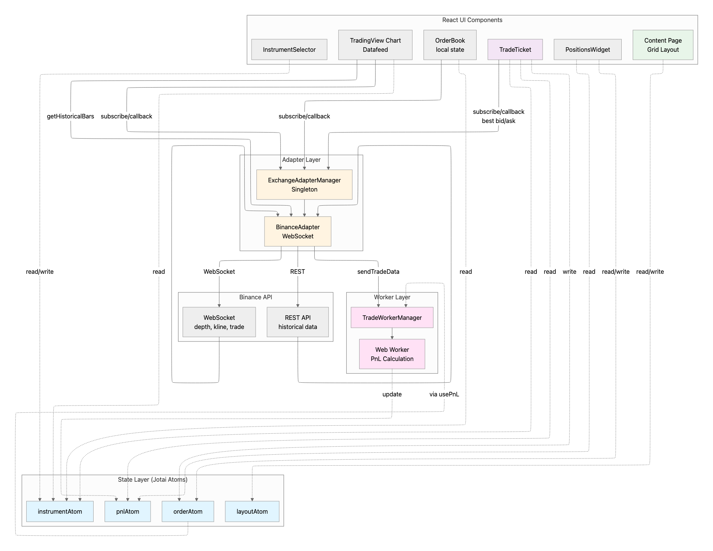

# Trading Application

A high-performance, real-time cryptocurrency trading application built with React, TypeScript, and modern web technologies.

[](https://vercel.com/new/clone?repository-url=https://github.com/HexiangLiu/trading-app)
[](https://app.netlify.com/start/deploy?repository=https://github.com/HexiangLiu/trading-app)


## 🚀 Quick Start

```bash
# Install dependencies
pnpm install

# Start development server
pnpm dev

# Open http://localhost:5173
```

## 📋 Features

- **Real-time Trading Data**: WebSocket integration with Binance API for live market data
- **Advanced Charting**: TradingView's lightweight charts library with custom datafeed
- **Order Management**: Create, submit, and track orders with full validation
- **Position Tracking**: Real-time PnL calculation with position aggregation
- **Responsive Layout**: Grid-based layout system with drag-and-drop resizing
- **Dark Mode**: Full theme support with persistent preferences
- **High Performance**: Optimized with Web Workers for heavy computations

## 🏗️ Architecture

### Overview



这张架构图展示了交易应用的整体系统设计，包含以下几个主要层次：

**1. React UI 组件层**
- **InstrumentSelector (交易对选择器)**: 负责选择交易对，与 `instrumentAtom` 进行读写操作
- **TradingView Chart Datafeed**: 为图表提供数据，从 `ExchangeAdapterManager` 获取历史K线数据和订阅实时数据
- **OrderBook local state**: 管理订单簿的本地数据，订阅最佳买卖价
- **TradeTicket (交易下单组件)**: 用于提交交易订单
- **PositionsWidget (持仓组件)**: 显示用户的当前持仓
- **Content Page Grid Layout**: 负责页面的整体布局

**2. 适配器层**
- **ExchangeAdapterManager Singleton**: 作为核心管理器，接收来自 UI 组件的请求并路由到具体的交易所适配器
- **BinanceAdapter WebSocket**: 具体的币安交易所适配器，负责通过 WebSocket 和 REST 与币安 API 进行通信

**3. 工作线程层**
- **TradeWorkerManager**: 管理交易相关的后台工作
- **Web Worker PnL Calculation**: 专门负责计算盈亏 (PnL)

**4. 状态层 (Jotai Atoms)**
- **instrumentAtom**: 存储当前选定的交易对信息
- **pnlAtom**: 存储盈亏数据
- **orderAtom**: 存储订单相关数据
- **layoutAtom**: 存储 UI 布局相关数据

**5. 数据源层**
- **Binance API**: 提供实时的市场深度、K线数据和交易数据流，以及历史数据

### Data Flow

**Real-time Market Data (OrderBook/TradeTicket):**
```
Components.subscribe() → BinanceAdapter → WebSocket → callback() → Component State
```

**PnL Calculation:**
```
orderAtom → PositionsWidget (usePnL) → TradeWorkerManager → Web Worker → pnlAtom
BinanceAdapter → TradeWorkerManager (trade data) → Web Worker → pnlAtom
```

**Historical Chart Data:**
```
Datafeed → BinanceAdapter.getHistoricalBars() → REST API → Chart Display
```

**Live Chart Data:**
```
BinanceAdapter → callback() → Datafeed → TradingView Chart
```

**Component Data Sharing:**
```
TradeTicket → write orderAtom → PositionsWidget reads orderAtom
InstrumentSelector → write instrumentAtom → Other components read instrumentAtom
Content → write layoutAtom → All widgets respond to layout changes
```

### Technology Stack

- **Framework**: React 18 + TypeScript 5.5
- **Build Tool**: Vite 5
- **State Management**: Jotai
- **Styling**: Tailwind CSS 4
- **Charting**: TradingView Lightweight Charts
- **Testing**: Vitest + Playwright
- **Code Quality**: Biome

### Architecture Components

**ExchangeAdapterManager (Singleton)**
- Manages multiple exchange adapters (Binance, future: Bybit, OKX)
- Provides unified interface for subscribing to streams
- Handles adapter lifecycle and connection status
- Acts as factory and dispatcher for exchange-specific adapters

**BinanceAdapter (Implements ExchangeAdapter)**
- Manages WebSocket connection to Binance API
- Receives direct subscriptions from Components via callbacks
- Converts Binance data formats to application types
- Provides historical data fetching via REST API (`getHistoricalBars`)
- Routes trade data to TradeWorkerManager for PnL calculation
- **Direct callback pattern**: Components subscribe directly, receive updates via callbacks

**Datafeed (TradingView Integration)**
- Implements TradingView's IBasicDataFeed interface
- Calls BinanceAdapter for historical data
- Connects TradingView Chart to BinanceAdapter
- Handles symbol resolution and data subscription

**TradeWorkerManager**
- Manages Web Worker lifecycle and communication
- Receives trade data from BinanceAdapter
- Processes orders and updates position data in background
- Prevents UI blocking during heavy PnL computations
- Publishes PnL updates to pnlAtom

**Jotai Atoms (Component Data Sharing)**
- **Role**: Shared state for data exchange between components
- **NOT** directly connected to Adapters
- **instrumentAtom**: Read by TV Chart, OrderBook, TradeTicket; Read/Write by InstrumentSelector
- **orderAtom**: Write by TradeTicket (creates orders); Read/Write by PositionsWidget (updates order status); Read by usePnL hook
- **pnlAtom**: Read by TradeTicket, PositionsWidget; Updated by Web Worker
- **layoutAtom**: Read/Write by Content page (drag-and-drop grid layout)
- Derived atoms: instrument name, positions list
- Storage atoms: orders, PnL, layout (with localStorage persistence)

### Key Decisions

See [Architecture Decision Records](./apps/web/docs/ADR-0001-state-layer.md) for detailed technical decisions.

## 📁 Project Structure

```
apps/web/
├── src/
│   ├── adapters/          # Exchange adapters
│   │   ├── index.ts       # ExchangeAdapterManager (singleton)
│   │   └── Binance/       # BinanceAdapter implementation
│   │       └── index.ts   # Connects to TradeWorkerManager
│   ├── components/        # React components
│   │   ├── basic/         # Reusable UI components
│   │   └── biz/           # Business components
│   │       ├── TradingViewChart/
│   │       │   └── datafeed.ts  # Connects to BinanceAdapter
│   │       ├── OrderBook/
│   │       ├── PositionsWidget/
│   │       └── TradeTicket/
│   ├── hooks/             # Custom React hooks
│   ├── services/          # Business logic services
│   ├── store/             # Jotai atoms
│   ├── types/             # TypeScript types
│   ├── utils/             # Utility functions
│   └── workers/           # Web Workers
│       ├── tradeAggregator.ts    # Worker logic (PnL calc)
│       └── tradeWorkerManager.ts # Receives from BinanceAdapter
├── docs/                  # Documentation (ADR)
└── e2e/                   # E2E tests
```

## 🧪 Testing

### Unit Tests

```bash
# Run unit tests
pnpm test

# Run with coverage
pnpm test:coverage
```

### E2E Tests

```bash
# Install Playwright browsers
pnpm test:e2e:install

# Run E2E tests
pnpm test:e2e
```

### Test Coverage

Current coverage: **>80%**

- ✅ Adapters: 96%
- ✅ Hooks: 100%
- ✅ Services: 100%
- ✅ Store: 100%
- ✅ Utils: 100%
- ✅ Workers: 94%

## 🚢 Deployment

### Build

```bash
pnpm build
```

### Preview

```bash
pnpm preview
```

### Deploy to Vercel

1. Push your code to GitHub
2. Import project in Vercel
3. Set build command: `pnpm build`
4. Set output directory: `apps/web/dist`
5. Deploy!

## 🔧 Development

### Prerequisites

- Node.js >= 18
- pnpm >= 8

### Available Scripts

```bash
# Development
pnpm dev              # Start dev server
pnpm build            # Build for production
pnpm preview          # Preview production build (in apps/web)

# Testing
pnpm test             # Run unit tests
pnpm test:coverage    # Run tests with coverage (in apps/web)
pnpm test:e2e         # Run E2E tests
pnpm test:e2e:install # Install Playwright browsers

# Code Quality
pnpm lint             # Lint code
pnpm format           # Format code with Biome
pnpm type-check       # TypeScript type checking
pnpm lighthouse       # Run Lighthouse CI
```

## 📚 Documentation

- [Architecture Decision Record](./apps/web/docs/ADR-0001-state-layer.md)
- [PRD](./PRD.MD)


